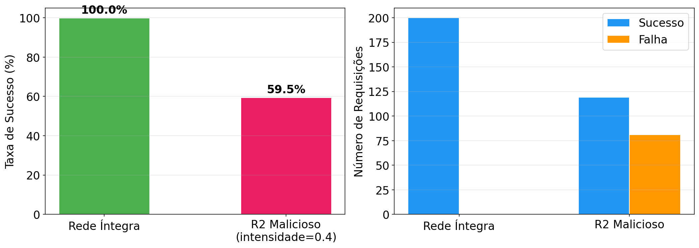
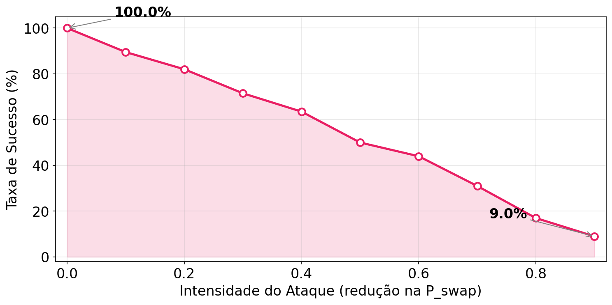

# QuantumNet

## QuantumNet: Um Simulador de Redes Quânticas Baseado em uma Arquitetura em Camadas com Interface Gráfica

As redes quânticas são fundamentais para a futura Internet Quântica, porém sua implementação prática ainda enfrenta restrições físicas e operacionais que dificultam a avaliação de protocolos em ambientes reais. Nesse contexto, simuladores tornam-se ferramentas essenciais para investigar arquiteturas, mecanismos de comunicação e aplicações de forma controlada e reprodutível. Este trabalho apresenta o **QuantumNet**, um simulador de redes quânticas de código aberto baseado em simulação de eventos discretos. A ferramenta adota uma arquitetura em camadas explícita, inspirada em modelos clássicos de redes e alinhada aos princípios arquiteturais e às RFCs emergentes da Internet Quântica, permitindo uma representação estruturada e orientada a padrões dos processos de comunicação. Esse alinhamento constitui um diferencial importante, ao promover interoperabilidade, reprodutibilidade e aderência aos esforços de padronização em andamento. Além disso, o **QuantumNet** oferece uma interface gráfica que facilita a configuração de parâmetros, a construção de topologias de rede e a visualização dos artefatos da simulação, tornando a ferramenta mais acessível tanto para pesquisa quanto para fins educacionais

# Estrutura do README.md
Este README está organizado da seguinte forma:

1. Título do projeto e resumo do artigo/artefato.
2. Selos considerados no processo de avaliação.
3. Informações básicas do ambiente e requisitos.
4. Dependências e recursos de terceiros.
5. Preocupações com segurança.
6. Instalação (Docker e local, com ou sem Jupyter).
7. Interface gráfica de configuração.
8. Teste mínimo de funcionamento.
9. Experimentos para reprodução das reivindicações.
10. Organização do repositório.
11. Licença.

# Selos Considerados

Os selos considerados são: **Artefatos Disponíveis (SeloD), Artefatos Funcionais (SeloF), Artefatos Sustentáveis (SeloS) e Experimentos Reprodutíveis (SeloR)**.

# Informações básicas

Esta seção apresenta os componentes necessários para execução e replicação dos experimentos.

- Sistema operacional: Linux, macOS ou Windows.
- Linguagem: Python 3.10.
- Containerização (opcional, recomendada): Docker + Docker Compose.
- Recursos mínimos sugeridos: 1 vCPU, 2 GB de RAM, ~2 GB de espaço livre em disco para instalação e execução de testes básicos.

# Dependências

Informações relacionadas a dependências e recursos necessários para execução:

- **Python** 3.10.
- Dependências principais em `requirements.txt`.
- Dependências extras para notebooks em `requirements-notebook.txt`.
- Benchmarks e scripts de experimento devem ser executados a partir dos módulos e exemplos do repositório.

# Preocupações com segurança

A execução do artefato **não** envolve manipulação de dados sensíveis, elevação de privilégios de sistema ou acesso obrigatório a serviços externos críticos.

Cuidados recomendados:

- Execute em ambiente isolado (virtualenv ou Docker).
- Revise scripts próprios antes de executar.
- Não exponha serviços de notebook em rede pública sem autenticação.

# Instalação

Ao final desta seção, a ferramenta estará pronta para execução em ambiente local ou com Docker, tanto por scripts Python quanto por notebooks Jupyter. A interface gráfica via Streamlit também estará disponível para configuração e inspeção da topologia.

## Execução com Docker

### Pré-requisitos

- [Docker](https://docs.docker.com/get-docker/) instalado.
- [Docker Compose](https://docs.docker.com/compose/install/) instalado (já incluso no Docker Desktop).

### Passo a passo

1. Clone o repositório:

```bash
git clone https://github.com/quantumgercom/QuantumNet.git
cd QuantumNet
```

2. Construa a imagem Docker:

```bash
docker compose build
```

3. Escolha uma opcao para iniciar o container:

Opcao A - Shell Python interativo:

```bash
docker compose run --rm quantumnet
```

Opcao B - Terminal bash:

```bash
docker compose run --rm quantumnet bash
```

4. Apos entrar no container (por qualquer uma das opcoes), execute scripts:

```bash
python3 seu_script.py
```

### Executar notebooks Jupyter com Docker

1. Construa a imagem de notebook:

```bash
docker compose build quantumnet-notebook
```

2. Inicie o serviço:

```bash
docker compose up quantumnet-notebook
```

3. Acesse no navegador:

```text
http://localhost:8888
```

4. Para encerrar:

```bash
docker compose down
```

### Reconstruir a imagem

Se alterar `requirements.txt`, `requirements-notebook.txt`, `Dockerfile` ou `Dockerfile.notebook`:

```bash
docker compose build --no-cache
```

## Alternativa: execução local com Python 3.10

1. Clone o repositório:

```bash
git clone https://github.com/quantumgercom/QuantumNet.git
cd QuantumNet
```

2. (Opcional) Crie e ative ambiente virtual:

```bash
python3.10 -m venv venv
source venv/bin/activate  # Linux/macOS
# ou
venv\Scripts\activate     # Windows
```

3. Instale as dependências:

```bash
pip install -r requirements.txt
```

4. Execute scripts:

```bash
python3 seu_script.py
```

# Interface gráfica de configuração (Streamlit)

A interface gráfica permite editar o arquivo padrão `quantumnet/config/default_config.yaml` por meio de uma sidebar com as seções **Parâmetros** e **Versão**.

## Rodar localmente

```bash
python -m quantumnet gui
```

## Rodar com Docker

```bash
docker compose run --rm --service-ports quantumnet python -m quantumnet gui --host 0.0.0.0 --port 8501
```

Depois, acesse:

```text
http://localhost:8501
```

# Teste mínimo

Esta seção apresenta um passo a passo para validar a instalação e execução básica. Você pode utilizá-la em qualquer cenário de instalação.

```python
from quantumnet.runtime import Clock
from quantumnet.topology import Network

# Cria o relógio e a rede com topologia em linha de 3 nós
clock = Clock()
net = Network(clock=clock)
net.config.topology.name = 'Line'
net.config.topology.args = [3]
net.set_ready_topology()

# Verifica se a topologia foi criada
assert len(list(net.nodes)) == 3, "Deveria haver 3 nós"
assert len(list(net.edges)) == 2, "Deveria haver 2 arestas"

# Verifica se os hosts possuem qubits na memória
for host_id in net.nodes:
    host = net.get_host(host_id)
    assert len(host.memory) > 0, f"Host {host_id} deveria ter qubits na memória"

# Verifica se pares EPR foram distribuídos nos canais
for u, v in net.edges:
    assert len(net.get_eprs_from_edge(u, v)) > 0, f"Canal ({u},{v}) deveria ter pares EPR"

# Executa uma requisição na camada de enlace
resultado = {}
net.linklayer.request(0, 1, on_complete=lambda **kwargs: resultado.update(kwargs))
clock.run()

assert 'success' in resultado, "O callback da camada de enlace deveria ter sido chamado"
print("Todos os testes passaram! O simulador está funcionando.")
```

Arquivo pronto no repositorio: `examples/teste_rapido.py`.
Execute:

```bash
# Localmente
python3 examples/teste_rapido.py

# Com Docker
docker compose run --rm quantumnet python3 examples/teste_rapido.py
```

# Experimentos

Esta seção descreve como reproduzir, a partir do artefato disponibilizado, as principais reivindicações associadas ao artigo.

## Reivindicação #1 — Execução de uma aplicação sobre a arquitetura em camadas

Esta reivindicação demonstra que o QuantumNet permite executar uma aplicação de alto nível sobre sua arquitetura em camadas. No cenário apresentado, o protocolo NEPR solicita pares EPR entre dois nós da rede, e o simulador processa essa requisição ao longo da pilha de comunicação, produzindo eventos, métricas e visualizações compatíveis com o comportamento do sistema.

Notebook correspondente: `examples/demo_nepr.ipynb`.

Considerando o ambiente do projeto previamente configurado, seja via Docker conforme descrito na seção de **Instalação** ou por instalação local das dependências, a reprodução deste caso de uso consiste na abertura do notebook Jupyter correspondente e na execução sequencial de todas as suas células.

### Passo a passo para rodar no Jupyter

1. Inicie o Jupyter:
```bash
# Docker
docker compose up quantumnet-notebook

# Local
jupyter notebook
```
2. Abra o notebook `examples/demo_nepr.ipynb`.

3. Execute todas as células em sequência (Run All).

4. Aguarde o término completo das execuções.

5. Verifique as saídas geradas no próprio notebook.

Tempo esperado: 1 a 10 minutos, dependendo da topologia e da quantidade de operações executadas.
Recursos esperados: aproximadamente 1 GB de RAM e baixo uso de disco.
Resultado esperado: execução bem-sucedida de múltiplas requisições NEPR entre dois nós da topologia, com geração de métricas de sucesso/falha, fidelidade média dos pares distribuídos, eventos de aplicação registrados em CSV e visualizações que evidenciam efeitos da infraestrutura subjacente, como decoerência e regeneração de qubits.

Exemplo de saida esperada para comparacao (figuras):


## Reivindicação #2 — Reprodução do agendamento de purificação na camada de enlace

Esta reivindicação demonstra que o artefato permite reproduzir um cenário de purificação em canal ruidoso, evidenciando o comportamento do agendamento híbrido e seu efeito sobre a continuidade do processo e a fidelidade final do enlace.

Notebook correspondente: `examples/demo_purification.ipynb`.

Considerando o ambiente do projeto previamente configurado, seja via Docker conforme descrito na seção de Instalação ou por instalação local das dependências, a reprodução deste caso de uso consiste na abertura do notebook Jupyter correspondente e na execução sequencial de todas as suas células.

### Passo a passo para rodar no Jupyter

1. Inicie o Jupyter:
```bash
# Docker
docker compose up quantumnet-notebook

# Local
jupyter notebook
```
2. Abra o notebook `examples/demo_purification.ipynb`.

3. Execute todas as células em sequência (Run All).

4. Aguarde o término completo das execuções.

5. Analise a saída textual final produzida pelo notebook.

Tempo esperado: 5 a 30 minutos, conforme o tamanho do cenário e o número de repetições.
Recursos esperados: 1 a 2 GB de RAM e baixo uso de disco para logs e arquivos auxiliares.
Resultado esperado: saída textual detalhando o processo de purificação, incluindo provisionamento inicial, falhas probabilísticas, tentativas de recuperação e conclusão bem-sucedida do agendamento híbrido, com fidelidade final compatível com o cenário configurado.

Exemplo de saida esperada para comparacao (figura):


## Reivindicação #3 — Reprodução do cenário de ataque a repetidores quânticos

Esta reivindicação demonstra que o artefato permite reproduzir um cenário de ataque do tipo black hole repeater, evidenciando o impacto de um repetidor malicioso sobre a taxa de sucesso da comunicação quântica.

Notebook correspondente: `examples/demo_attack.ipynb`.

Considerando o ambiente do projeto previamente configurado, seja via Docker conforme descrito na seção de Instalação ou por instalação local das dependências, a reprodução deste caso de uso consiste na abertura do notebook Jupyter correspondente e na execução sequencial de todas as suas células.

### Passo a passo para rodar no Jupyter

1. Inicie o Jupyter:
```bash
# Docker
docker compose up quantumnet-notebook

# Local
jupyter notebook
```
2. Abra o notebook `examples/demo_attack.ipynb`.

3. Execute todas as células em sequência (Run All).

4. Aguarde o término completo das execuções.

5. Verifique os gráficos e métricas gerados ao final da execução.

Tempo esperado: 5 a 20 minutos, conforme os parâmetros do cenário.
Recursos esperados: 1 a 2 GB de RAM e baixo uso de disco para saídas do experimento.
Resultado esperado: geração de visualizações comparativas mostrando a diferença entre a rede íntegra e a rede com repetidor malicioso, bem como a degradação da taxa de sucesso à medida que aumenta a intensidade do ataque.

Exemplo de saida esperada para comparacao (figuras):




## Reivindicação #4 — Uso da interface gráfica para configuração e validação da topologia padrão

Esta reivindicação demonstra que o QuantumNet permite configurar parâmetros e topologia pela interface gráfica e, em seguida, validar essa configuração com um exemplo reproduzível.

Notebook correspondente: `examples/demo_default_topology.ipynb`.

### Passo a passo para reproduzir

1. Inicie a interface gráfica:
```bash
# Local
python -m quantumnet gui

# Docker
docker compose run --rm --service-ports quantumnet python -m quantumnet gui --host 0.0.0.0 --port 8501
```
2. Abra no navegador o endereço exibido no terminal (por padrão, `http://localhost:8501`).

3. Ajuste os parâmetros desejados na sidebar e salve a configuração.

4. Inicie o Jupyter e execute o notebook de validação:
```bash
# Docker
docker compose up quantumnet-notebook

# Local
jupyter notebook
```
5. Abra `examples/demo_default_topology.ipynb` e execute todas as células em sequência (Run All).

Tempo esperado: 1 a 10 minutos.
Recursos esperados: aproximadamente 1 GB de RAM e baixo uso de disco.
Resultado esperado: carregamento bem-sucedido dos arquivos padrão de configuração (`default_config.yaml`) e topologia (`default_topology.json`), com criação da rede sem erros e confirmação dos parâmetros aplicados.

Exemplo de saida esperada para comparacao (trecho textual do notebook):

```text
Config: .../quantumnet/config/default_config.yaml
Topology JSON: .../quantumnet/config/default_topology.json
Config exists? True
Topology exists? True

Topology name: Json
Topology arg: ['default_topology.json']
Nodes: [0, 1, 2, 3, 4]
Edges: [(0, 3), (1, 2), (1, 3), (1, 4), (2, 3), (2, 4), (3, 4)]
```

Exemplo adicional de saida textual (roteamento):

```text
Routing table por host:

Host 0 (0)
{0: [0], 3: [0, 3], 1: [0, 3, 1], 2: [0, 3, 2], 4: [0, 3, 4]}
```

# Organização do repositório

- `docs/`: documentação técnica dos módulos principais (camadas, configuração, relógio, controle e topologia).
- `examples/`: notebooks de demonstração e reprodução dos experimentos descritos neste README.
- `quantumnet/`: código-fonte principal do simulador (runtime, camadas, topologia, GUI, controle e configurações padrão).
- Arquivos na raiz: infraestrutura e suporte de execução (`Dockerfile`, `docker-compose.yml`, `requirements*.txt`, `LICENSE` e este `README.md`).

# Licença

Este projeto está licenciado sob os termos descritos no arquivo `LICENSE` do repositório.
